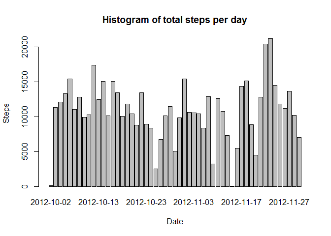
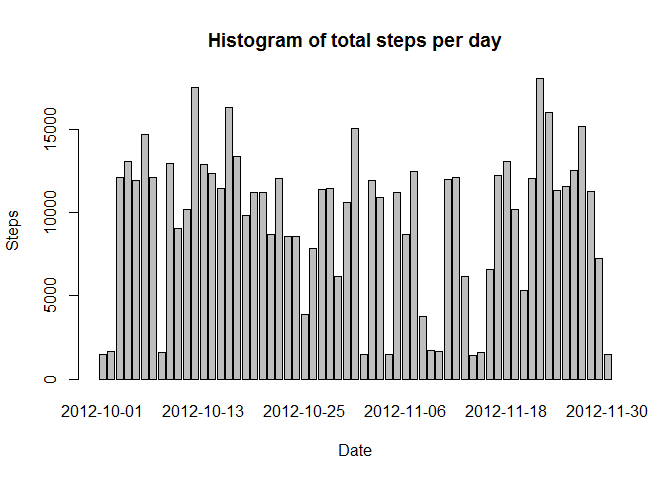
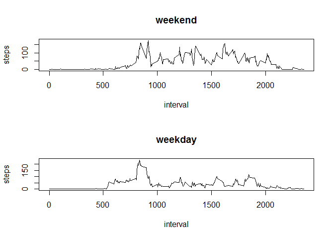

# Reproducible Research: Peer Assessment 1


## Loading and preprocessing the data


```r
    unzip("activity.zip")
    data <- read.csv("activity.csv")
```


## What is mean total number of steps taken per day?

### Histogram of daily steps

```r
    daily_steps <- aggregate(steps ~ date, data = data, FUN = sum)
    barplot(daily_steps$steps, names.arg = daily_steps$date, xlab = "Date", 
            ylab = "Steps", main = "Histogram of total steps per day")
```

 

### Mean & Median daily steps

```r
    mean(daily_steps$steps, na.rm = TRUE)
```

```
## [1] 10766
```

```r
    median(daily_steps$steps, na.rm = TRUE)
```

```
## [1] 10765
```


## What is the average daily activity pattern?

### Time series plot of the 5 min interval and avg number of steps

```r
    interval_steps <- aggregate(steps ~ interval, data = data, FUN = mean)
    plot(interval_steps, type = "l")
```

 

### Interval with maximum number of steps

```r
    max <- interval_steps$interval[which.max(interval_steps$steps)]
    max
```

```
## [1] 835
```


## Imputing missing values

### Total number of missing values

```r
    missing <- sum(is.na(data))
    missing
```

```
## [1] 2304
```

### Filling missing values

```r
    na_set <- is.na(data$steps)
    data <- merge(data, interval_steps, by = "interval", suffixes = c("", ".y"))
    data$steps[na_set] <- data$steps.y[na_set]
```

### New data

```r
    data <- data[,c(1:3)]
```

### Histogram new data

```r
    daily_steps <- aggregate(steps ~ date, data = data, FUN = sum)
    barplot(daily_steps$steps, names.arg = daily_steps$date, xlab = "Date", 
            ylab = "Steps", main = "Histogram of total steps per day")
```

 

```r
    mean(daily_steps$steps)
```

```
## [1] 9564
```

```r
    median(daily_steps$steps)
```

```
## [1] 11216
```


## Are there differences in activity patterns between weekdays and weekends?

### Day type

```r
    day <- function(date) {
        if (weekdays(as.Date(date)) %in% c("Saturday", "Sunday")) {
            "weekend"
        } else {
            "weekday"
        }
    }

    data$day <- as.factor(sapply(data$date, day))
```

### Plot 

```r
    par(mfrow = c(2, 1))
    for (type in c("weekend", "weekday")) {
        steps_by_type <- aggregate(steps ~ interval, data = data, subset = ( data$day == type) , FUN = mean)
        plot(steps_by_type, type = "l", main = type)
    }
```

 
